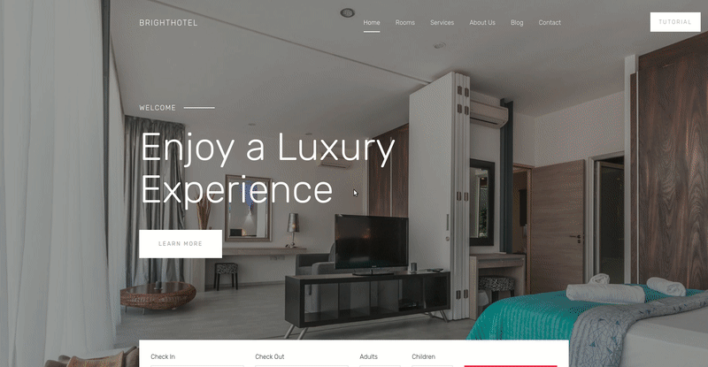

<h1 align="center">Site-Tutorial</h1>

Is easy, animated, a lot of functionality, flexible, step tutorial for your site.

<p align="center">
 
</p>

You can test plugin. Clone project and start the next commands:

```
npm install
gulp start
```

## Usage

<h3>HTML</h3>

```html
<div site-tutorial-step="1" tutorial-title="Title 1" tutorial-text="Text" />
<div site-tutorial-step="2" tutorial-title="Title 2" tutorial-text="Text" />
```

<h3>JavaScript</h3>

```javascript
var options = { time: 1500 };

var tutorial = new SiteTutorial();

document.querySelector("elem")
  .addEventListener("click", function() {
    tutorial.initialize();
  });
```

## Getting started

Just download plugin and include to your HTML.

```html
<!-- JS file -->
<script src="path/to/site-tutorial.js"></script>
```

Site-Tutorial is very simple to use.

1. Choose node elements which you want to see highlighted and set it main attribute `site-tutorial-step="1"` with step parameter;
2. Also you can add `tutorial-title="title"` and `tutorial-text="text"` attributes for title and text respectively;
3. Add event listener to node elem and call `tutorial.initialize()`;
4. Create js file and create object and pass options to argument `new SiteTutorial(options)`;

## Popup

You can create custom popup or use default popup. For add custom popup just pass parameter to options `popup: DOM element`. Default popup stay like default parameter, but for use it you need to connect styles. Link to styles - [download](https://www.google.com  "Default popup styles").

```js
var options = { popup: document.getElementById("DOM-Element") };

new SiteTutorial(options);
```

<h3>Custom popup setting</h3>

| id                            | Description                                                            |
| ----------------------------- | ---------------------------------------------------------------------- |
| `site-tutorial-control-panel` | Main block. Add this id for block which will follow to highlight area. |
| `stop-site-tutorial`          | This stops tutorial and scroll page to top.                            |
| `next-site-tutorial`          | It switchs to next step.                                               |
| `prev-site-tutorial`          | It switchs to previous step.                                           |

## Progress bar

You can connect progress bar, add `progressBar` property to oprions and pass the next parameters.

```js
var options = {
  progressBar: {
    color: "#FF3A41",
    counter: true
  }
};

new SiteTutorial(options);
```

| Parameters | Default value | Type        | Description                |
| ---------- | ------------- | ----------- | -------------------------- |
| `color`    | `#000`        | **string**  | Set color for progress bar |
| `counter`  | `false`       | **boolean** | Add step counter           |


<h3>! Important</h3>

> For use progress bar in custom popup you need to add block with `id="progress-site-tutorial"` and add that block to `div` with required `width`.


## Steps

Steps is a main part tutorial. You can control every step through `steps` option. Every step has `title`, `text`, `callback`, parameters and steps begin from `0`.

> `title`, `text`, properties has higher priority, then value in attributes.

```js
var options = {
  steps: {
    0: {
      title: "Title",
      text: "Text",
      callback: function(nodeElem) {
        alert("innerHTML: " + nodeElem.innerHTML);
      }
    },
    1: {
      callback: function(nodeElem) {
        nodeElem.style.backgroundColor = "#fff";
      }
    }
  }
}

new SiteTutorial(options);
```

| Parameters | Default value | Type         | Description                                                          |
| ---------- | ------------- | ------------ | -------------------------------------------------------------------- |
| `title`    | `""`          | **string**   | Set title on step                                                    |
| `text`     | `""`          | **string**   | Set text on step                                                     |
| `callback` | `null`        | **function** | Call function after end animation. Function has current DOM Element. |

## Async callback

Every step has one common callback and current step callback (see above). Async callback will allow to await result and in process execution all button will be block, that willn't allow to do next, or previous step or stop tutorial. For that return Promise. See how to this use below.


```js
var options = {
  callback: function(nodeElem) {
    return new Promise((resolve, reject) => {
      var timeOut = setInterval(() => {
        alert("Time is stop!")
        resolve();
      }, 1000);
    });
  }
}

new SiteTutorial(options);
```

## Control

There is a possibility control tutorial with keyboard. Keys - `←` - step back, and `→` - step forward.

## API

| Options       | Default value   | Type            | Description                                             |
| ------------- | --------------- | --------------- | ------------------------------------------------------- |
| `popup`       | `default popup` | **DOM Element** | See above.                                              |
| `time`        | `1000`          | **number**      | Time execution animation.                               |
| `opacity`     | `0.7`           | **number**      | Background opacity.                                     |
| `zIndex`      | `1000`          | **number**      | Set z-index for tutorial.                               |
| `padding`     | `10`            | **number**      | Set offset for highlighted area. **Max value - 15**     |
| `outclick`    | `false`         | **boolean**     | Add posibility close tutorial after outclick popup.     |
| `autoStart`   | `false`         | **boolean**     | Add posibility start tutorial after loading page.       |
| `progressBar` | `null`          | **object**      | Add progress bar to popup.                              |
| `steps`       | `null`          | **object**      | With this option you can control every step. See above. |
| `callback`    | `null`          | **function**    | Call function after stop animation.                     |


## License

site-tutorial is Copyright © 2015-2018 Codica. It is released under the [MIT License](https://opensource.org/licenses/MIT).

## About Codica

[](https://www.codica.com)

We love open source software! See [our other projects](https://github.com/codica2) or [hire us](https://www.codica.com/) to design, develop, and grow your product.
